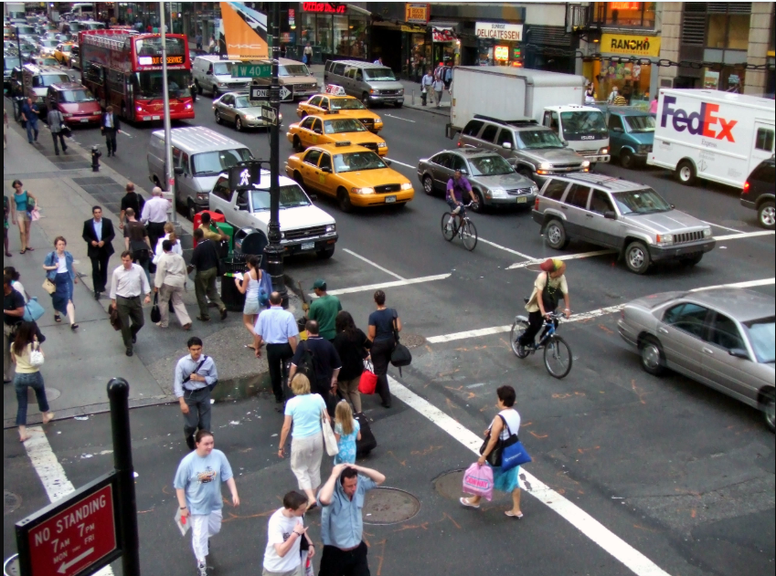
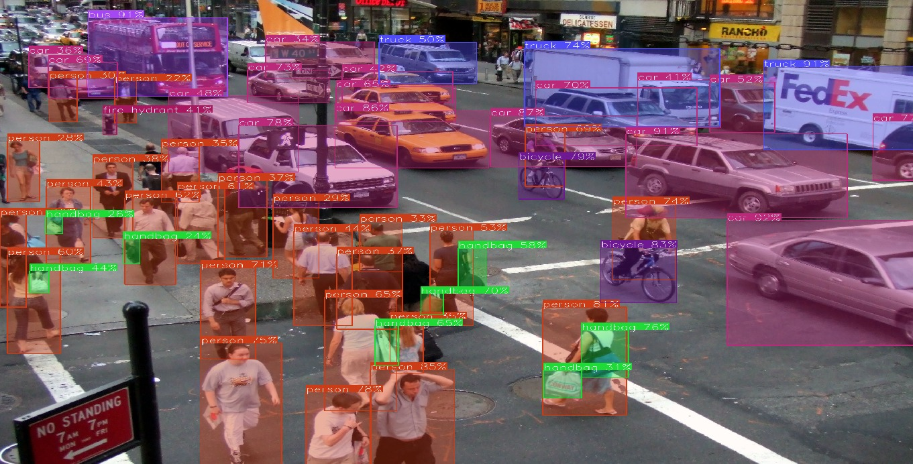
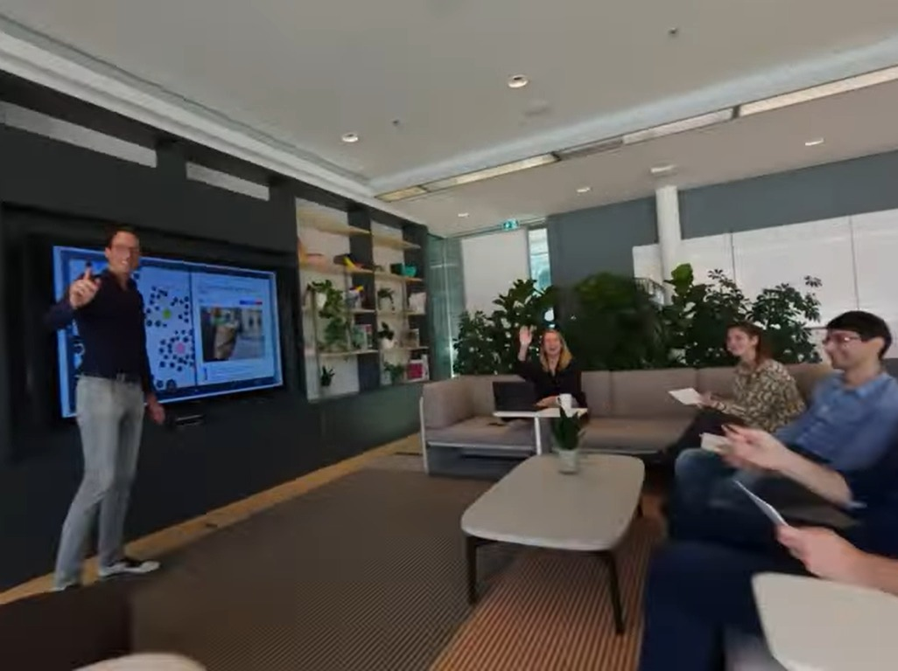
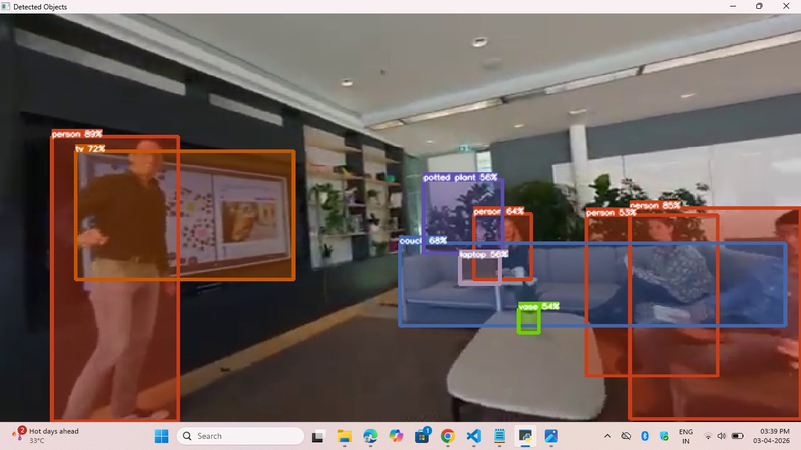
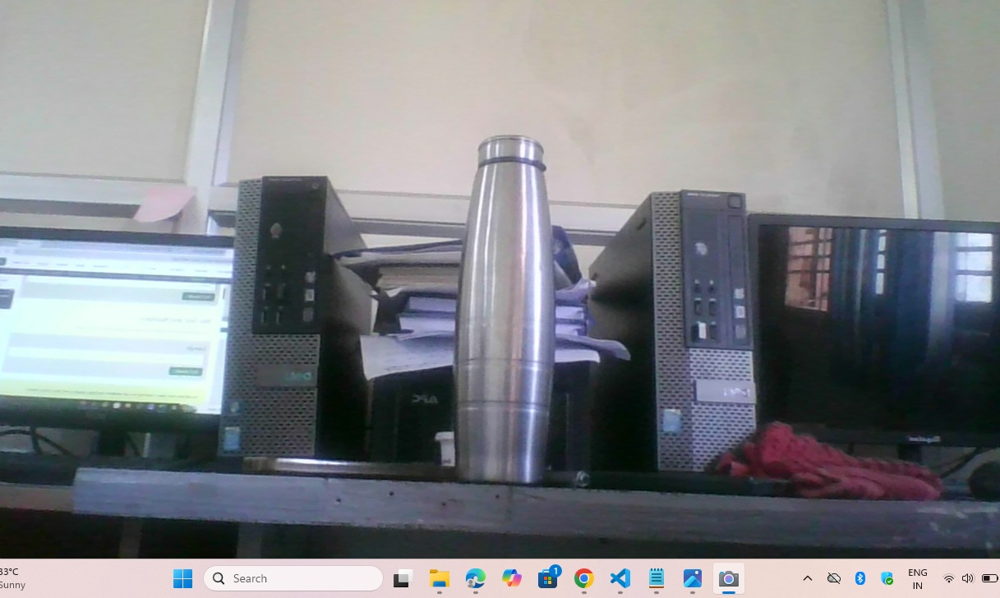
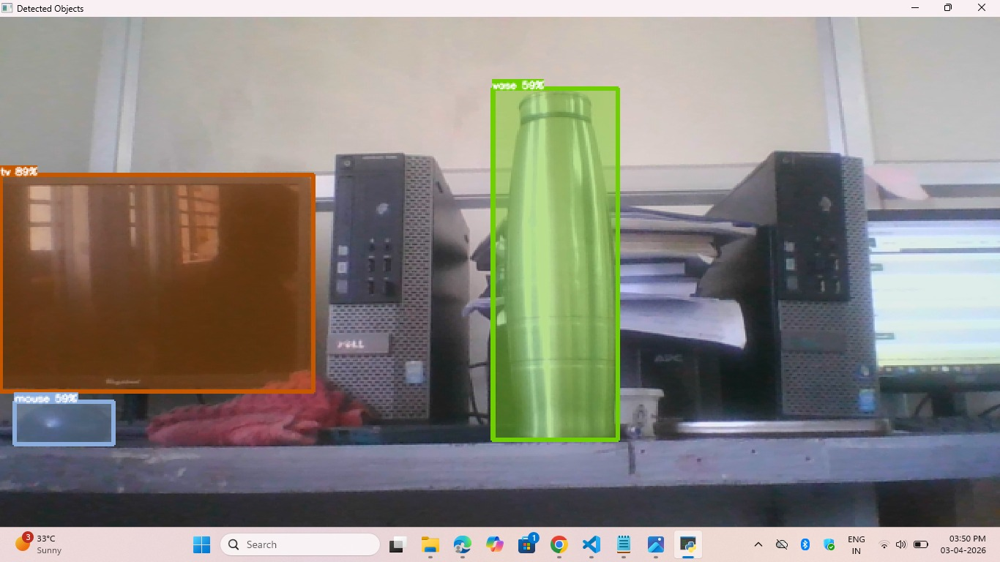

# 🔍 Advanced Object Detection for Seamless Application Integration

A deep learning-based object detection system that processes both static images and dynamic videos to detect, classify, and label objects with confidence scores using state-of-the-art algorithms like YOLO, SSD, and RetinaNet.

---

## 📌 Table of Contents

- [Overview](#overview)
- [Features](#features)
- [Screenshots](#screenshots)
- [System Architecture](#system-architecture)
- [Project Structure](#project-structure)
- [Algorithms Used](#algorithms-used)
- [Modules](#modules)
- [Tech Stack](#tech-stack)
- [Hardware & Software Requirements](#hardware--software-requirements)
- [Object Detection Libraries](#object-detection-libraries)
- [How It Works](#how-it-works)
- [Future Enhancements](#future-enhancements)
- [References](#references)
- [Author](#author)

---

## 📖 Overview

This project develops an advanced object detection system capable of:
- Analyzing **static images** and **dynamic videos**
- Drawing **bounding boxes** around detected objects
- Displaying **object labels** with **confidence/accuracy scores**
- Supporting multiple input modes: uploaded images, live webcam, and video URLs

Traditional methods like Haar Cascades, HOG, and SIFT required manual feature extraction and struggled with real-world variations. This system leverages **deep learning (CNNs)** to automatically learn features, achieving faster and more accurate detections.

---

## ✨ Features

- ✅ Real-time object detection using YOLO
- ✅ Multi-object detection in a single frame
- ✅ Bounding box generation with class labels and confidence scores
- ✅ Support for image upload, live webcam, and external video URLs
- ✅ Robust to variations in lighting, scale, orientation, and occlusion
- ✅ No manual feature engineering required

---

## 📸 Screenshots

### 🖼️ Image Input & Output

> Upload a static image → System detects objects → Bounding boxes with labels and confidence scores are displayed.

| Input Image | Output Image |
|:-----------:|:------------:|
|  |  |

---

### 🎥 Video Input & Output

> Provide a video file or URL → System extracts frames → Detects and classifies objects frame by frame.

| Video Input (Frame) | Video Output (Detected Frame) |
|:-------------------:|:-----------------------------:|
|  |  |

---

### 📷 Webcam Live Detection Input & Output

> Start webcam → Live frames are captured → Real-time object detection with bounding boxes and labels.

| Webcam Input (Live Feed) | Webcam Output (Live Detection) |
|:------------------------:|:------------------------------:|
|  |  |

---

> 📁 **Note:** Add your actual screenshots inside a `screenshots/` folder in the root of this repository.  
> Rename them as: `image_input.png`, `image_output.png`, `video_input.png`, `video_output.png`, `webcam_input.png`, `webcam_output.png`

---

## 🏗️ System Architecture

```
Media Input
    ├── Image Upload (JPEG, PNG)
    ├── Webcam Live Video
    └── External Video URL (YouTube, Vimeo, etc.)
         ↓
Processing Module
    ├── Data Preprocessing (resize, normalize)
    ├── Object Detection Model (YOLO / SSD / RetinaNet)
    ├── Bounding Box Generation
    └── Confidence Score Calculation
         ↓
Output Display
    ├── Labeled Bounding Boxes
    ├── Object Class Names
    └── Detection Accuracy Percentage
```

---

## 📁 Project Structure

```
advanced-object-detection/
│
├── screenshots/                    # Input & Output screenshots
│   ├── image_input.png
│   ├── image_output.png
│   ├── video_input.png
│   ├── video_output.png
│   ├── webcam_input.png
│   └── webcam_output.png
│
├── static/                         # Static assets (CSS, JS, images)
│   ├── css/
│   │   └── style.css
│   └── js/
│       └── main.js
│
├── templates/                      # HTML templates (Flask/Django)
│   ├── index.html
│   ├── image_detect.html
│   ├── video_detect.html
│   └── webcam_detect.html
│
├── models/                         # Pre-trained model weights
│   ├── yolov3.weights
│   ├── yolov3.cfg
│   └── coco.names
│
├── modules/                        # Core detection modules
│   ├── image_detection.py          # Image upload & detection
│   ├── video_detection.py          # Video processing & detection
│   └── webcam_detection.py         # Live webcam detection
│
├── utils/                          # Utility functions
│   ├── preprocess.py               # Image/frame preprocessing
│   ├── draw_boxes.py               # Bounding box drawing
│   └── confidence.py               # Confidence score calculation
│
├── uploads/                        # Uploaded media files (auto-created)
│
├── outputs/                        # Processed output files (auto-created)
│
├── app.py                          # Main Flask application entry point
├── requirements.txt                # Python dependencies
└── README.md                       # Project documentation
```

---

## 🤖 Algorithms Used

### 1. YOLO (You Only Look Once)
- Processes the **entire image in a single neural network pass**
- Divides image into a grid; predicts bounding boxes and class probabilities per cell
- Supports multiple versions: YOLOv3, YOLOv4, YOLOv5
- Ideal for **real-time applications** (surveillance, autonomous vehicles, traffic monitoring)

### 2. SSD (Single Shot MultiBox Detector)
- Detects objects at **multiple scales** using feature maps from different CNN layers
- Predicts default bounding boxes with various aspect ratios
- Balances **speed and accuracy** effectively
- Compatible with backbone networks: VGG, ResNet, MobileNet

### 3. RetinaNet
- Uses **Focal Loss** to handle class imbalance between foreground objects and background
- Built on a **Feature Pyramid Network (FPN)** over ResNet backbone
- Excellent performance on small or rare objects
- Widely used in satellite imagery and medical image analysis

---

## 🧩 Modules

### 📤 Image Upload
- Handles local image uploads (JPEG, PNG)
- Validates formats and file sizes
- Securely stores uploaded images

### 📷 Webcam Live Video
- Captures real-time video streams from the user's webcam
- Processes frames for continuous object detection

### 🔗 URL Link of Video
- Accepts external video URLs (e.g., YouTube, Vimeo)
- Retrieves and processes frames from the stream

---

## 🛠️ Tech Stack

| Category | Tools / Libraries |
|---|---|
| Language | Python 3 |
| Deep Learning | TensorFlow, PyTorch, Keras |
| Computer Vision | OpenCV, Pillow |
| Web Framework | Flask / Django |
| Object Detection | YOLO, SSD, RetinaNet, ImageAI |
| Other Libraries | NumPy, Darkflow, GluonCV, Detectron2 |

---

## 💻 Hardware & Software Requirements

### Software
- **OS**: Windows 10
- **Language**: Python 3
- **Frameworks**: TensorFlow, PyTorch, OpenCV

### Hardware
| Component | Minimum Specification |
|---|---|
| Processor | Intel Core i7 |
| RAM | 8 GB |
| Storage | 500 GB HDD |

---

## 📚 Object Detection Libraries

| Library | Description |
|---|---|
| **ImageAI** | Python library for object detection using TensorFlow/PyTorch; supports 80+ common objects |
| **GluonCV** | State-of-the-art CV framework; supports MXNet and PyTorch |
| **Detectron2** | Facebook AI's PyTorch-based library; supports Mask R-CNN, DensePose, Panoptic FPN |
| **YOLOv3_TensorFlow** | High-speed TensorFlow implementation of YOLOv3 with GPU acceleration |
| **Darkflow** | Python/TensorFlow translation of Darknet; supports YOLO models and custom weight loading |

---

## ⚙️ How It Works

### Image Processing Pipeline
```
Start → Load Image → Detect Objects → Classify Objects
      → Draw Bounding Boxes → Display Labels → End
```

### Video Processing Pipeline
```
Start → Load Video → Extract Frames → Detect Objects in Frame
      → Classify Objects → Draw Bounding Boxes → Display Labels
      → Confidence Score Calculation → Output Visualization → End
```

### Webcam Live Detection Pipeline
```
Start Webcam → Capture Frame → Preprocess Frame → Detect Objects
             → Classify Objects → Draw Bounding Boxes → Display Labels
             → Loop Next Frame → Stop on Exit
```

---

## 🚀 Future Enhancements

### 1. Automatic Object Tracking
- Integrate **Deep SORT** for real-time object tracking across video frames
- Use **Kalman filters** to predict future object positions
- Assign unique IDs to track multiple objects simultaneously
- ✔ Reduces computational cost by avoiding redundant detections
- ✔ Enables motion analysis for surveillance and autonomous systems

### 2. AR (Augmented Reality) Visualization
- Overlay bounding boxes and labels onto the real-world environment
- Support for **Microsoft HoloLens**, **ARKit (iOS)**, **ARCore (Android)**
- Gesture-based interactions for zooming and filtering
- ✔ Immersive experience for security, retail, and navigation applications

---

## 📄 References

1. S. Guefrachi et al., "Deep learning based DeepFake video detection," ICSCA 2023.
2. J. Redmon et al., "You only look once: Unified, real-time object detection," CVPR 2016.
3. W. Liu et al., "SSD: Single shot multibox detector," ECCV 2016.
4. S. Ren et al., "Faster R-CNN: Towards real-time object detection with region proposal networks," NIPS 2015.
5. M. Sandler et al., "MobileNetV2: Inverted residuals and linear bottlenecks," CVPR 2018.
6. M. Everingham et al., "The PASCAL VOC challenge," IJCV 2010.
7. A. Geiger et al., "Are we ready for autonomous driving? The KITTI vision benchmark suite," CVPR 2012.
8. L. C. Dua et al., "Encoder-decoder with atrous separable convolution for semantic segmentation," ECCV 2018.
9. H.-C. Nguyen et al., "Unified YOLOv5-HR-TCM Framework for Human Pose Estimation," Sensors 2022.
10. C. Cao et al., "Real-time object detection in augmented reality," IEEE TVCG 2017.
11. H. C. Shin et al., "Deep CNNs for computer-aided detection," IEEE Trans. Medical Imaging 2016.

---

## 📃 License

This project is developed for academic purposes. Please refer to your institution's guidelines for usage and distribution.

---

## 👨‍💻 Author

<table>
  <tr>
    <td align="center">
      <b>Monisha D</b><br/>
      Object Detection Project Developer
    </td>
  </tr>
</table>

### 📞 Contact

| Platform | Link |
|---|---|
| 🐙 GitHub | [github.com/Monisha71326](https://github.com/Monisha71326) |
| 💼 LinkedIn | [linkedin.com/in/monisha-d-8909a93b3](https://www.linkedin.com/in/monisha-d-8909a93b3) |
| 📧 Email | [iammonisha.dev@gmail.com](mailto:iammonisha.dev@gmail.com) |

---

<p align="center">Made with ❤️ by <a href="https://github.com/Monisha71326">Monisha D</a></p>
